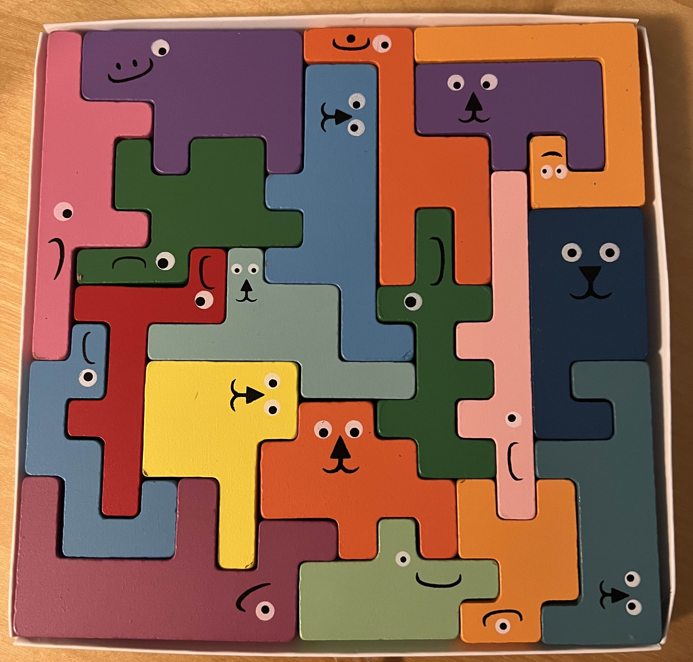

# jigsaw_puzzle

My daughter got a jigsaw puzzle as a gift. It seemed quite hard to solve - my daughter is 4 years old and there is no way she could solve it. I didn't have the patience either but I felt like it would be fun to write a program that would solve it. So I did that. :) I wasn't actually sure if it would work, or if the combinatorial explosion would cause the solve time to be too long. But it turned out to solve in just 45 seconds on my machine. 🎉

The algorithm uses a depth first search. I think the reason it actually works is that instead of branching off by selecting any piece, position and rotation, I opted to explore only the pieces, positions and rotations that cover the next empty slot on the board. This removes all redundancy from the search tree, and quickly prunes out some branches since a lot of these options will not fit.